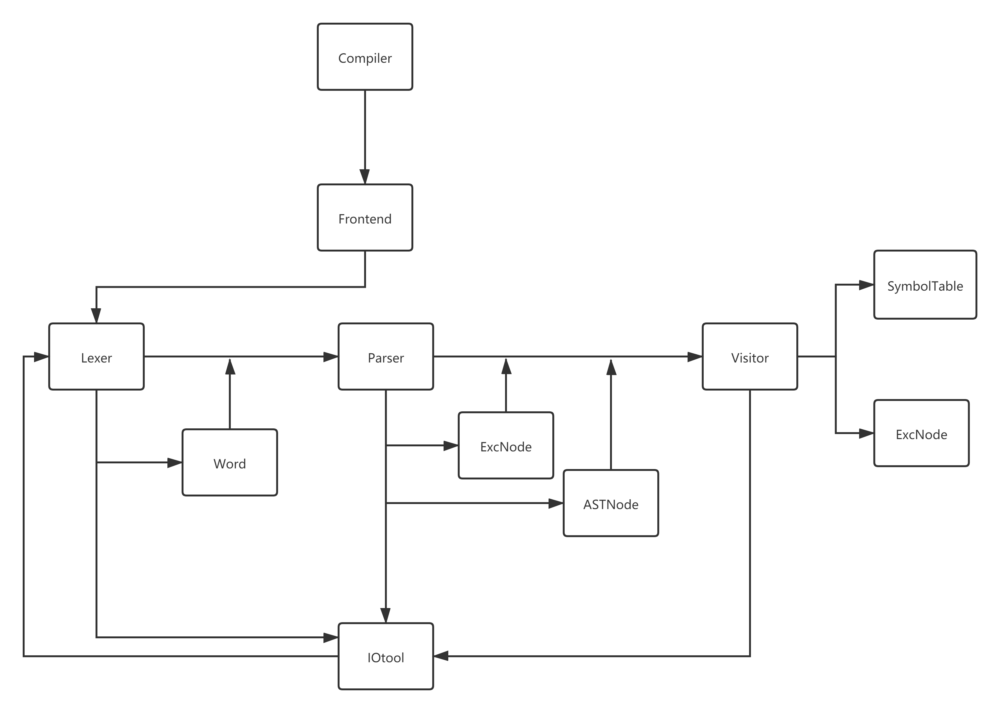
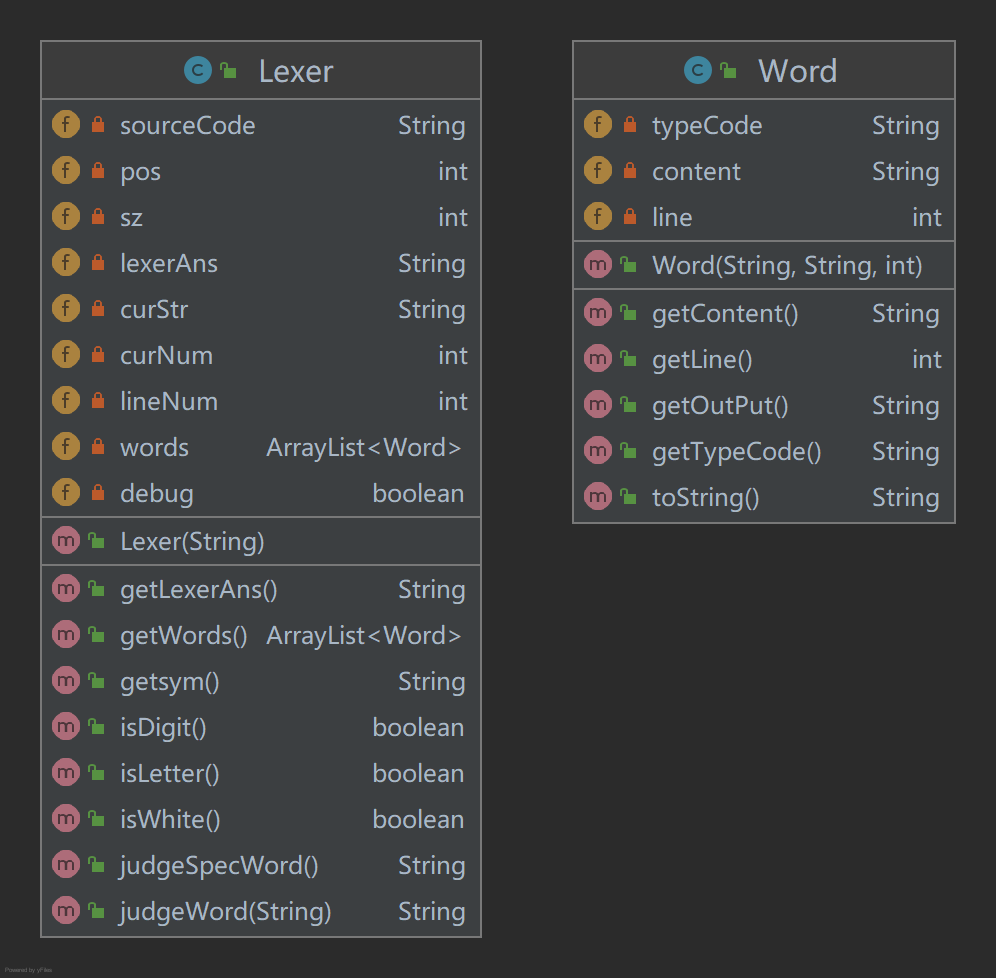
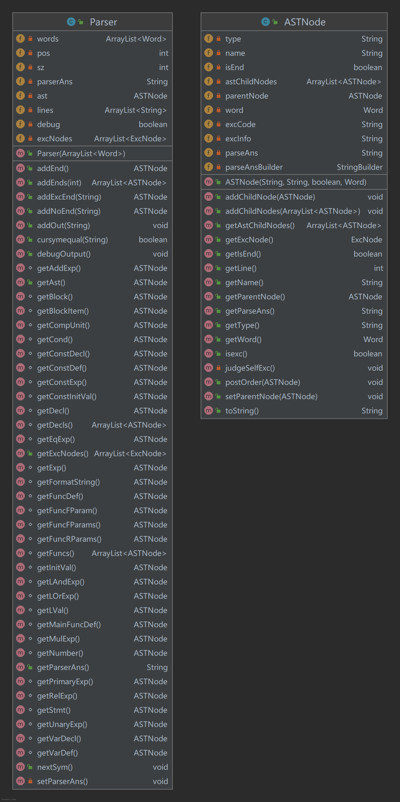
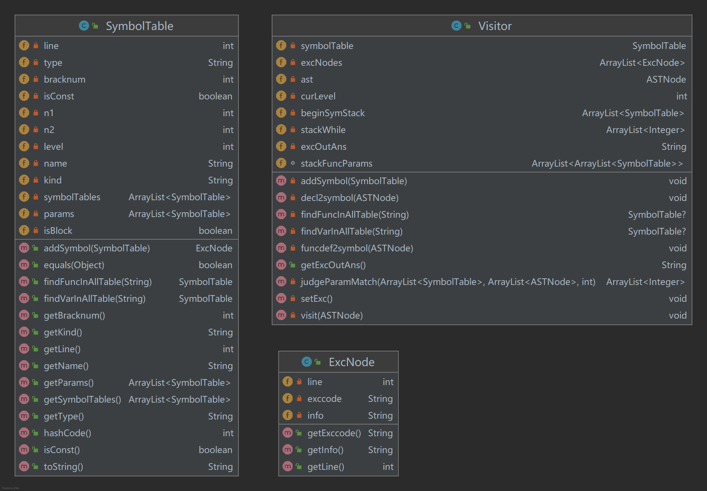
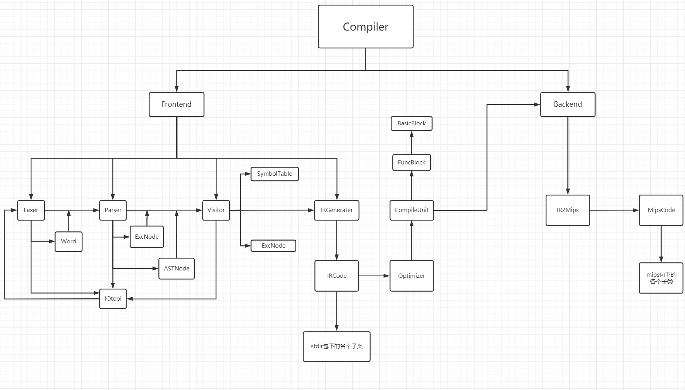

# 编译器设计文档

# 阶段一 前端基础设计

## 总体架构



本阶段编译器总体设计如上图所示。顶层为`Compiler`类，由`Frontend`类进行前端各个类之间的处理流程和数据传输。首先先利用`IOtool`类获得输入，之后将输入的代码送入`Lexer`
进行词法分析，由词法分析将代码转换成`token`形式的单词表，用`Word`类存储，将这个`Word`类的列表作为`Parser`语法分析的输入数据，`Parser`进行语法分析并处理`a/i/j/k`
四个简单错误，输出抽象语法树和一个错误节点的列表，作为`Visitor`的输入，`Visitor`遍历语法树建立符号表并处理其他的语义层面和符号相关错误，输出完整的错误列表和符号表。整个过程中由各个类完成输出字符串拼接，由`IOtool`
类输出字符串到文件。

`Frontend`类主函数代码如下

```Java
public Frontend()throws IOException{
    IOtool iOtool=new IOtool();//创建IO工具
    Lexer lexer=new Lexer(iOtool.getInput());//词法分析
    iOtool.outputAns(lexer.getLexerAns());
    Parser parser=new Parser(lexer.getWords());//语法分析
    iOtool.outputAns(parser.getParserAns());
    Visitor visitor=new Visitor(parser.getAst(),parser.getExcNodes());//符号表管理与错误处理
    iOtool.outputError(visitor.getExcOutAns());
}
```

## 词法分析

使用`Lexer`类完成，主要实现了一个`getsym`方法，作为接口可以单独给语法分析动态提供输入，也可以在类内被构造函数调用输出词法分析的输出。同时在类内使用全局变量`pos`
对当前的字符位置做标记，便于更新和回溯。具体判断上，将字符分成三类，标识符类，数字类，其他字符类。标识符类判断是否为保留字或者自定义标识符，其他字符对每个字符做特定的处理转换成相应的输出。具体类方法和变量如下图所示。

`Lexer`主方法如下

```Java
public Lexer(String sourceCode){
    this.sourceCode=sourceCode;
    sz=sourceCode.length();
    while(true){
        String ret=getsym(); //调用getsym方法更新字符位置和获取当前的符号码
        if(ret.equals("INTCON")){
            words.add(new Word(ret,String.valueOf(curNum),lineNum));
        }else if(!ret.equals("annotation")&&!ret.equals("EOF")){
            //忽略注释和结尾
            words.add(new Word(ret,curStr,lineNum));
        }
        if(ret.equals("EOF"))break;
    }
    if(debug){
        System.out.println(lexerAns);
    }
}
```



## 语法分析

建立`Parser`类完成这部分内容，使用递归下降的方式对词法分析得到的`Word`类列表进行语法分析，利用一个`pos`表示当前的符号指针。建立了一个`ASTNode`类保存了每个语法树节点的`type`，`name`,`Word`
，`isEnd`，`astChildNodes`属性信息。在分析过程中对每个节点都增加保存他们的子节点信息，从而完成语法树建立。建立过程中保存输出结果作为语法分析的输出。下图是类图。

对于原有文法中有左递归的部分进行了消除处理，比如`AddExp → MulExp | AddExp ('+' | '−') MulExp`改为`AddExp → MulExp {('+' | '−') MulExp} `
，类似的还有`MulExp/RelExp/EqExp/LAndExp/LOrExp`。为了保证输出符合要求，在每次遇到这样的节点时如果有多个子节点会在每个非终结符子节点遍历结束后增加输出当前类别码。

`Parser`主方法如下

```Java
public Parser(ArrayList<Word> words){
    this.words=words;
    this.sz=words.size();
    this.ast=getCompUnit(); //获取顶层模块，不断递归向下拆解分析
}
```



## 错误处理

建立了`Visitor`类，`ExcNode`类，`SymbolTable`类三个类实现错误处理和符号表管理。

对`Parser`类进行了修改，实现了对缺少`; ) ]`以及`FormatString`中异常字符这四种错误进行了处理，具体来说就是读到特定字符时如果没有就生成一个异常节点放入树中，同时将错误信息用`ExcNode`
类保存，从而不影响正常的语法分析和语法树遍历。

`SymbolTable`类主要保存了符号的信息：是否为块也就是块类型，函数类型或是变量类型，函数类型会有`params`，每个`param`也是符号表类，保存相应的参数维数信息。而变量类型则会记录维数。

`Visitor`类对`Parser`生成的语法树进行**后序遍历**
，维护一个符号表栈，每次进入一个节点，先对这个节点可能出现的错误进行处理，包括符号重定义，未定义以及各种语义错误。对于每个标识符，都会先查符号表，从当前层逐层向上查找，将查到的符号和当前符号进行比对，根据情况决定是否加入符号表和错误处理。如果当前节点是`block`
节点，则将这个`block`生成的一个符号放入符号表栈中。之后进行子节点遍历，遍历完成结束再将这个`block`节点出栈。

`Visitor`主方法如下

```java
public Visitor(ASTNode ast,ArrayList<ExcNode> excNodes){
    this.ast=ast; //初始化语法树
    this.excNodes=excNodes; //初始化错误节点列表
    this.beginSymStack.add(new SymbolTable("global",0)); //初始化符号表，建立顶层符号表对象
    visit(ast); //后序遍历语法树，进行错误处理与符号表管理
    setExc(); //将错误节点列表转换为字符串输出
}
```

以下是三个类的类图



参考网站:
https://gcc.godbolt.org/

# 阶段二 代码生成

## 最终架构



### 顶层模块代码

```java
		/**
         * frontlevel:
         *       1-->lexer
         *       2-->lexer parser
         *       3-->lexer parser error-process
         *       4-->all frontend basic
         *       5-->all frontend basic and frontend optimizer
         */
int frontlevel = 5;
Frontend frontend = new Frontend(frontlevel);
		/**
         * backlevel:
         *       0-->backend close
         *       1-->backend open
         *       2-->optimizer version backend
         */
int backlevel = 2;
Backend backend = new Backend(frontend.getIrCodes(), backlevel, frontend.getCompileUnit());
```

顶层可以设置编译的等级，前端有5个等级，从词法分析一直到最后的中间代码生成和优化

后端有3个等级，分别是后端关闭，打开基础版本的后端生成，优化版本的后端生成

## 中间代码生成

经过 `preprocess` 目录下各个类的处理，经过词法分析，语法分析，错误处理，得到了完整正确的语法树，如果错误处理阶段发现了问题，前端将直接打印错误信息和停止编译过程，如果没错，则继续调用后面的中间代码生成器 `IRGenerater`，以及后面的优化器 `Optimizer` 进行中间代码生成和优化。

```Java
public Frontend(int level) throws IOException {
    /**
         * lexer analysis
         */
    IOtool iOtool = new IOtool();
    Lexer lexer = new Lexer(iOtool.getInput());
    iOtool.outputAns(lexer.getLexerAns());
    if (level <= 1) return;
    /**
         * Parser analysis
         */
    Parser parser = new Parser(lexer.getWords());
    iOtool.outputAns(parser.getParserAns());
    if (level <= 2) return;
    /**
         * Error process
         */
    Visitor visitor = new Visitor(parser.getAst(), parser.getExcNodes());
    iOtool.outputError(visitor.getExcOutAns());
    if (level <= 3) return;
    if (!visitor.getExcOutAns().equals("")) {
        System.out.println("Source code has wrong.");
        return;
    }
    /**
         *Intermediate code generate
         */
    IRGenerater irGenerater = new IRGenerater(parser.getAst());
    this.irCodes = irGenerater.getIrcodes();
    if (level <= 4) return;
    Optimizer optimizer = new Optimizer(this.irCodes, irGenerater.getRegNum());
    irCodes = optimizer.getIrCodes();
    outputIrcodes("ircode.txt");
    compileUnit = optimizer.getCompileUnit();
}
```

### 中间代码设计

|       种类       |                    说明                    |
| :--------------: | :----------------------------------------: |
|   `ArrayDecl`    |            `arr int array[sym]`            |
| `ArrayLoadStore` |  `array[index]=rsym` `lsym=array[index]`   |
|   `CondBranch`   |      `cmp syma, symb` `bne/beq label`      |
|      `Decl`      |            `var int sym = rsym`            |
|      `Exp`       |          `lsym = rsym1 op rsym2`           |
|    `FuncCall`    | `push sym1 ... push symn`  `call funcname` |
|    `FuncDecl`    |            `void/int funcname`             |
|   `FuncParam`    |              `param type sym`              |
|    `FuncRet`     |                 `ret sym`                  |
|     `IRCode`     |                    基类                    |
|      `Jump`      |                `goto label`                |
|     `Label`      |                  `label:`                  |
|     `Printf`     |     `printf formatstr (sym1,sym2...)`      |

除了中间代码类还包含一个表示标识符，数字的工具类`Sym`，存储在每个中间代码类中便于输出和方便进行后续优化。同时还单独设计了一个符号表类`SymTable`来充当中间代码部分和后端部分的符号表。子类有`Block` `Var` `Func` 分别代表块，函数，变量。块里存储了多个包含函数和变量在内的符号，每个符号内部存储了这个类型的变量信息，包含类型，种类，所在块深度等需要用到的信息。

### 中间代码生成方法

#### 基本方法

仍然利用递归下降分析法对源代码的语法树进行解析。同时在解析过程中对于每一个语法成分生成相应的中间代码。对于全局变量和函数定义，在解析结束之后将相应的符号存入符号表，同时转换成相应的定义语句的中间代码。对于`Block`来说，主要包含`Stmt` `Decl` 两大类，对于`Decl`，采用和全局变量一致的方式生成，变量处于的位置标记全局或者局部变量，全局变量开头有`%`，局部变量开头是`@`。对于`Stmt`根据具体情况调用相应的子函数进行分析和生成，包括`while/if`块，调用函数，表达式求值等，同时使用一个临时变量编号，对生成过程中需要临时变量的位置赋予相应的`t`开始的变量名字，这些临时变量在后端解析时被转换成临时寄存器。解析过程中和错误处理一致，遇到符号从内层依次向外查找，这里利用了一个栈来管理。

```
private ArrayList<Block> blockstack = new ArrayList<>();
int curLevel=0;
```

`curLevel`代表当前所在的层，每当经历一个块结束或者块开始，就减增`curLevel`，同时加入`Block`对象实例。每次查表从`curLevel`开始从大到小查找。类似的也对`while`循环的开始结束标签利用栈进行管理处理递归的循环内的`continue`和`break`语句

#### 短路求值

对于`if/while`块的短路求值，模仿成熟的`mips-gcc`编译器的输出结果，做以下转换。先对内层的`RelExp`表达式进行计算，转换成相应的中间变量，再对这个临时变量使用`bne/beq`跳转的方式，跳转到提前设置好的标签。同一个`LOrExp`下的每个`LAndExp`的前面若干个对应`bne`语句，如果不成立直接跳转到下一个`LOrExp`的条件判断处；对于最后一个`LAndExp`采用`beq`如果成立了直接跳到`if`块内开始处。以下就是一个鲜明例子

```C
#源代码
if (i == 1&&i==2||i==3) {
	return 1;
}

#中间代码
cond_if_1_0:
cmp %i, 1
bne cond_if_1_1
cmp %i, 2
beq if_1_begin
cond_if_1_1:
cmp %i, 3
bne if_1_end
if_1_begin:
block_1_begin:
ret 1
block_1_end:
goto if_1_end_1
if_1_end:
if_1_end_1:
```

同时这里面涉及到的`while/if`相关标签的标号都由全局变量累加进行生成和管理

## MIPS代码生成

### MIPS目标代码类设计

|      种类       |                        描述                        |         说明         |
| :-------------: | :------------------------------------------------: | :------------------: |
|    `Assign`     |         `li $reg value` `move $reg1 $reg2`         |       赋值指令       |
|    `BrJump`     | `j/jal label` `jr $31` `beq/bne $reg1 $reg2 label` |       跳转指令       |
|   `Calculate`   |   `op $reg1 $reg2` `op $reg1 $reg2 value/$reg3`    |       计算指令       |
| `LabelMipsCode` |                    `labelname:`                    |         标签         |
|   `LoadStore`   |        `lw/sw/la $reg1 offset($reg2)/label`        |       访存指令       |
|      `MTF`      |             `mthi/mfhi/mtlo/mflo $reg`             |    乘除寄存器指令    |
|  `StackManage`  |   `subi/addi $sp $sp offset` `sw/lw $reg 0($sp)`   | 栈指针管理和使用指令 |
|    `Syscall`    |              `li $2 value` `syscall`               |       系统掉用       |
|   `MipsCode`    |                        基类                        |                      |

对前端`Optimizer`类生成的`CompileUnit`类进行处理

### 全局变量定义解析

先解析其中的全局变量定义，将相应的目标代码用一个`DataCodes`列表存储，并最终放在`.data`段，全局变量和字符串常量都存放在这个位置。普通数字变量使用`.word 123`这样的方式进行定义。对于数组如果原来有初始化则开多行`.word value`，如果没有初始化则默认全为0，类似`.space 128`开空间即可。字符串常量在之后解析到`Printf`时将相应的字符串标记代码比如`str1: .asciiz "hello"`放入`.data`段。

### 函数解析

#### 局部变量存储

对于一般的函数，局部变量存储在`栈`中，即`$sp`指针指向的地址中。对于`main`函数，局部变量存储在堆段，由于本课程没有涉及动态空间分配和跨文件调用，所以我直接将堆的地址作为一个常量在`java`代码中使用，使用时就存入符号表并累加，避免了使用指针来进行存取。普通函数的局部变量存储时设计成采用相对于堆的负数的地址，比如`sw $2 -12($sp)`，这样做是为了和实参数进行区分，函数由于要接受传入的实参，因此实参必定是在`$sp`之上，为了不引起递归时的混淆，参数统一在函数内部运行时在`$sp`之上，局部变量则在`$sp`之下。

#### 函数调用

普通函数的传参采用直接`push`参数到栈指针内的方式，并不断减小，同时将需要的寄存器值和返回地址也存入，在调用完函数之后，再退栈，将寄存器值和返回地址存入相应的寄存器。普通数字变量传参采用直接将值`push`进栈，对于数组变量采用`push`地址进栈，返回值用`$v0`保存，将其赋值给需要的寄存器即可。例子如下

```asm
sw $31 0($sp) #先压入31号返回地址寄存器
li $3 0x0
addi $3 $3 0x1001001c
sw $3 -4($sp) #压入数组参数
li $5 0xc
addi $5 $5 0x10040000
sw $5 -8($sp) #压入数组参数
subi $sp $sp 12 #栈空间压缩
jal funcAA
addi $sp $sp 12 #退栈，栈空间回收
lw $31 0($sp) #恢复31号寄存器值
move $6 $2 #将$v0的值给需要的寄存器
sw $6 0x10040018($0)
lw $3 0x10040018($0)
```

#### 一般的代码翻译

设计了一个工具类`Namespace`，类似`enum`枚举变量，保存数字，寄存器，标签，根据`type`属性区分。方便归一管理和操作。每一个`MipsCode`子类都使用了`Namespace`类作为自己的属性来导出代码。

对于一般的表达式，定义函数`lsym2ns` `rsym2ns` `rsym2ns2`三个函数，目的是将前端的`Sym`类转换成后端的`ns`类，一般是寄存器形式，从而方便进行代码生成，将`sym`转换为`namaspace`之后，就可以很方便的使用`MIPS`指令进行后续操作。具体转换方法是，针对前端标记好的不同形式的变量，比如`% @ t &`等不同的开头符号，确定相应的`Sym`的语义类型。临时变量`t`将其与寄存器建立联系，并返回寄存器。定义的变量则先从内存中`load`出来数据到寄存器中再返回。遇到被分配了寄存器的变量则直接返回相应的寄存器。

对于其他的代码，也是类似，先利用`sym2ns`系列的函数，将前端的每个中间代码中的`Sym`类利用符号表和一定的规则转换为相应的寄存器变量或者数字变量，让后端在输出时可以很好的输出。

#### 后端符号表

后端也复用了前端中间代码生成阶段的符号表，并在前端符号表内加入了地址和一些标记变量易于处理。

具体划分区域使用前端标记好的`Label`进行区分，每次到了新的一层，即检测到`Label`字符串符合某种格式比如`block_func`开头，`block_main`开头，`block_`开头，就进行相应的处理，比如在符号表内创建新的`Block`，或者删除符号表指针。

#### 寄存器分配

此处仅讨论临时寄存器分配，全局寄存器分配见下一部分的图着色介绍。

本次作业我们能够使用的寄存器有`3,5-28`号，其他的均需要使用。其中临时寄存器是`3,5-15,24-28`

```java
int[] tmpregs = {3, 5, 6, 7, 8, 9, 10, 11, 12, 13, 14, 15, 24, 25, 26, 27, 28};
int[] globalregs = {16, 17, 18, 19, 20, 21, 22, 23};
private HashMap<Integer, Boolean> regpool = new HashMap<>();
private HashMap<Integer, Sym> globalreg2sym = new HashMap<>(); //16-23
private HashMap<Integer, Sym> tmpreg2sym = new HashMap<>(); //3 5-15 24-28
```

临时寄存器采用`FIFO`策略，先来先使用，每条语句结束之后会先检查哪些寄存器使用了但是没有与变量关联（即没用），或者与变量关联了但是这个变量之后无用了（即出口处不活跃且这条语句是最后被使用的），将这些无用寄存器先置为空闲。设计了一个`getReg`方法。即如果有空闲的，直接用。没有空闲的，寻找有无没有和某个变量联系的寄存器，有，则使用这个。如果还没有，就直接使用第一个寄存器。

```java
private Namespace getReg() {
    for (int reg : tmpregs) {
        if (!regpool.get(reg) && !tmpreg2sym.containsKey(reg)) {
            regpool.put(reg, true);
            return new Namespace(reg, 0);
        }
    }
    for (int reg : tmpregs) {
        if (!tmpreg2sym.containsKey(reg)) {
            regpool.put(reg, true);
            return new Namespace(reg, 0);
        }
    }
    return new Namespace(tmpregs[0], 0);
}
```

每解析完一个函数，释放所有的临时寄存器和全局寄存器。每开始解析一个函数，设置相应的全局寄存器信息。

## 代码优化

### 基本块划分与整体架构

整体的中间代码按照`编译模块-函数-基本块-语句`进行数据结构组织。编译模块类由`Optimizer`类创建，输入为`IRCode`的列表，先对已有的`IRCode`送入`Flatter`类进行处理，将所有的二维数组的存取展开成一维的存取，比如下面的存取原本都存在`ArrayLoadStore`一个类中，现在将其拆开方便原子化处理。

```
t1 = x * 2 
t2 = y + t1 
z = a[t2]
```

输出仍然一样，但是已经分别属于了三个对象实例，即两条计算指令和一条存取指令。同时将局部数组初始化的赋值部分也类似的拆开成一个没有初始化的`ArrayDecl`对象和若干`ArrayLoadStore`对象。之后再将展开成原子化的中间代码序列传入`Divoptimizer`类进行处理，将所有除数为常数的表达式代码转换成乘法位移和加法指令，输出转换后的中间代码列表。

将除法优化后的中间代码送入`CompileUnit`类进行初步处理，处理方式为将中间代码列表分成全局变量定义，若干函数两部分。函数用`FuncBlock`类进行建模表示。`FuncBlock`类里存有若干个内部的基本块类和自己的一些必要信息，比如冲突图和寄存器分配结果，还有优化的函数方法。基本块用`BasicBlock`类进行建模，内部包含若干`IRCode`类语句列表，定义使用链信息，定值使用链信息等。

对于每一个函数块，使用一个`BasicBlockDivide`类进行基本块划分。基本方法是遍历一遍，寻找能够跳转到其他地方的语句，其下一句为第一句。可以被其他地方跳转到的第一条语句。函数调用的下一句。还有第一条语句，并做好标记。找出第一条语句的集合之后，进行后续的分割即可。同时每个基本块内部还有`prevs`和`nextvs`记录了流图中的后继节点和前驱节点。确定方式为如果末尾是无条件跳转代码，则其跳转到的标签所在的基本块B是这个基本块A的后继结点，对偶的，A是B的前驱结点。如果是有条件跳转，则其下一个基本块和跳转到的基本块与他互为前后继结点。如果末尾是其他代码，则与其下一个基本块互为前后继。

中间代码的数据结构可视化输出结果如下所示

```asm
arr int @e3[4]
arr int @f3[3]
arr int @ii3[2][2]
@ii3[0] = 9
@ii3[1] = 8
@ii3[2] = 7
@ii3[3] = 6
=======================funcAA-begin=======================
***********************BasicBlock-0begin***********************
int funcAA()
para int[] %x
para int[] %y
block_func_funcAA_begin:
var int %tempp = 0
t0 = %x[0]
t1 = t0
t2 = %y[0]
t1 = t1 + t2
%tempp = t1
ret %tempp
block_func_funcAA_end:
decline_init_end:
***********************BasicBlock-0end***********************
=======================funcAA-end=======================
=======================main-begin=======================
***********************BasicBlock-0begin***********************
block_main_begin:
t6 = @ii3[0]
t9 = @ii3[1]
t12 = @ii3[2]
t15 = @ii3[3]
arr int %j3[2][3]
%j3[0] = t6
%j3[1] = 2
%j3[2] = t9
%j3[3] = 4
%j3[4] = t12
%j3[5] = t15
var int %temp3 = 0
push &@ii3[0]
push &%j3[3]
call funcAA
t16 = RET
***********************BasicBlock-0end***********************
***********************BasicBlock-1begin***********************
%temp3 = t16
printf "%d\n" %temp3
mainfunc_ret_0:
block_main_end:
***********************BasicBlock-1end***********************
=======================main-end=======================
```

### 基本块内优化

#### 除法与取余优化

参考文章:https://www.cnblogs.com/shines77/p/4189074.html和论文`Division by Invariant Integers using Multiplication`，重点参照`gcc x86`汇编转换代码

基本原理如下

只考虑除数为常数的优化，除数不是常数不考虑优化。假设计算过程为$m/t,m\%t(t为常数)$ 

先将$t$转换为绝对值$n$，此处只描述除法，取余在除法后面加上一条乘法和一条减法指令

* **先得到魔数**
  * 先算出一个`magic`数$s$，公式如下：$f=2^{31+k}/n$  $s=|f|$，其中s是对$f$这个浮点数结果的取整，具体向上向下取整需要考虑以下判别条件
  * 假设向上取整为$s1$，向下取整为$s2$，计算$|s1-s|$和$|s2-s|$与$2^{k-1}/n$的大小关系，选取符合小于关系的那个作为取整结果。
* **再通过移位和加法指令得到结果**
  * 先得到$s*m$的高32位$l$，$l$先算术右移$k-1$位得到$l_1$，再逻辑右移31位得到$l_2$，之后$l_1+l_2$即为商
* **如果t为负数**
  * 将商取反即可，用$0$减去上一步得到的商

##### 对于n是2的次幂的情况

设$|n|=2^k$

* 如果$t$是正数，前端直接移k位即可完成
* $t$是负数，后端先将$m$取反，再移正数位数即可

#### 窥孔优化

### 全局优化

#### 活跃变量分析

对每个函数进行分析，扫描所有的基本块。每个基本块内部有相应的计算`def-use`链的方法，每次计算出入口和出口处的活跃变量，同时计算出每个变量的在基本块内使用情况，注意对于数组变量这个活跃变量的表示是`a[index]`和`a`而不只是`a`，因为会涉及到数组某个数值的引用。公式为

$out(B)=\cup \ in[Prev(B)]$

$in(B)=use(B)\cup(out(B)-def(B))$

`def`为第一次定义在使用之前的，`use`为第一次使用在定义之前的。

#### 定值使用链分析

对每一个定义了变量的位置，分析其在这个基本块内还会被使用到的位置。

后继节点，活跃变量分析和定值使用链分析输出结果如下：

```asm
***********************BasicBlock-0begin***********************
nextvs:[]
outs[]
ins:[%x[0], %y, %x, %y[0]]
defs:[t0, t1, t2, %tempp]
uses:[%x[0], %y, %x, %y[0]]
duchains:[[], [], [], [], [10], [6], [8, 9], [8], [9], [10], [], [], []]
***********************BasicBlock-0end***********************

***********************BasicBlock-0begin***********************
nextvs:[1]
outs[t16]
ins:[@ii3[0], @ii3[2], @ii3, t16, @ii3[1], @ii3[3]]
defs:[t6, %j3[4], t9, t15, %j3[1], %j3[3], t12, %j3[0], %j3[5], %j3, %temp3, %j3[2]]
uses:[@ii3[0], @ii3[2], @ii3, @ii3[1], @ii3[3]]
duchains:[[], [6], [8], [10], [11], [13], [13], [13], [13], [13], [13], [13], [], []]
***********************BasicBlock-0end***********************
***********************BasicBlock-1begin***********************
nextvs:[]
outs[]
ins:[t16]
defs:[%temp3]
uses:[t16]
duchains:[[1], [], [], []]
***********************BasicBlock-1end***********************
```

#### 死代码删除

对于每一个基本块的代码，如果某个定义的变量在结尾处不活跃且在这个基本块内后续也没有用到，则这个代码是无用的。利用前述的两个分析即可实现。同时由于每次删除完一行可能有其他的也可以被删除，因此需要多轮活跃变量、定值使用分析和删除过程，直到代码数量稳定。具体代码如下，直到和上一次代码完全相同才停止分析和删除过程。

```java
ArrayList<ArrayList<IRCode>> lastbblockcodes;
while (true) {
    lastbblockcodes = new ArrayList<>();
    for (int i = 0; i < basicBlocks.size(); i++) {
        lastbblockcodes.add(new ArrayList<>(basicBlocks.get(i).getIrCodes()));
    }
    activeAnalysis();
    deleteDiedCodes();
    boolean allsame = true;
    for (int i = 0; i < basicBlocks.size(); i++) {
        if (!lastbblockcodes.get(i).equals(basicBlocks.get(i).getIrCodes())) {
            allsame = false;
            break;
        }
    }
    if (allsame) {
        break;
    }
}
```

#### 图着色与全局寄存器分配

由于我没有实现对于函数之间的依赖分析，因此只能做函数内局部变量的全局变量寄存器分配。具体方式为对每一个基本块入口处的活跃变量即`in`集合，这些变量之间存在相互冲突，同时记录每个变量的引用次数。以此建立起了冲突图。之后利用`Chaitin-Briggs算法`进行图着色，即每次寻找一个小于全局寄存器数目的度的变量进行分配，将其移除出图并着色，再对其他变量进行着色，如果某一轮找不到符合条件的，就寻找一个被引用次数最少的变量直接移除出图，不分配寄存器。

例如对于以下代码

```C
int getDif3N(int min,int max){
    int i=1,j=1,k=1;
    int cnt=0;
    int arr1[2]={1,2};
    while(i<=3){
        j=1;
        while(j<=3){
            k=1;
            while(k<=3){
                if(i!=j&&i!=k&&j!=k){
                    cnt=cnt+1;
                }
                k=k+1;
            }
            j=j+1;
        }
        i=i+1;
    }
    return cnt;
}
```

相应的寄存器分配信息如下

```
{%j=10, %i=13, %k=7, %cnt=14}
{}
[%cnt, %i, %j, %k]
```

最后应该给`%cnt %i %j %k`四个变量进行全局寄存器分配。

#### 循环无用代码删除

循环代码在中间代码的体现为某个基本块的后继基本块的编号比自己小。对满足这样条件的基本块区间进行分析，如果这一段内不存在对于其他基本块活跃的变量，且没有输入输出语句，函数调用，没有对全局变量的修改，则认为这个循环块无用，可以删除。这个对以下代码效果显著。

源代码

```asm
int d = 4;

int hhh(int i){
    int c = i * i;
    if (i == 1) {
        return 1;
    }
    if (i == 2) {
        return 2;
    }
    c = c * c % 10;
    return hhh(i - 1) + hhh(i - 2);
}

int main () {
    int i = 2,j = 5;
    i = getint();
    j = getint();
    j = 7*5923/56*56 - hhh(hhh(3)) + (1+2-(89/2*36-53) /1*6-2*(45*56/85-56+35*56/4-9));
    int k = -+-5;
    int n = 10;
    while (n < k*k*k*k*k*k) {
        d = d * d % 10000;
        n = n + 1;
    }
    printf("%d, %d, %d\n", i, j, k);
    return 0;
}
```

优化后代码

```asm
var int @d = 4
int hhh()
para int %i
block_func_hhh_begin:
t0 = %i
t0 = t0 * %i
var int %c = t0
cond_if_1_0:
cmp %i, 1
bne if_1_end
if_1_begin:
block_1_begin:
ret 1
block_1_end:
goto if_1_end_1
if_1_end:
if_1_end_1:
cond_if_2_0:
cmp %i, 2
bne if_2_end
if_2_begin:
block_2_begin:
ret 2
block_2_end:
goto if_2_end_2
if_2_end:
if_2_end_2:
t6 = %i
t6 = t6 - 1
push t6
call hhh
t5 = RET
t8 = t5
t10 = %i
t10 = t10 - 2
push t10
call hhh
t9 = RET
t8 = t8 + t9
ret t8
block_func_hhh_end:
decline_init_end:
block_main_begin:
var int %i = 2
var int %j = 5
%i = getint()
%j = getint()
push 3
call hhh
t14 = RET
push t14
call hhh
t13 = RET
t15 = 41440 - t13
t16 = t15
t16 = t16 + -10091
%j = t16
var int %k = 5
var int %n = 10
cond_while_1_0:
while_1_end:
printf "%d, %d, %d\n" %i-%j-%k
mainfunc_ret_0:
block_main_end:
```

可以看到无用的循环块被删除了


